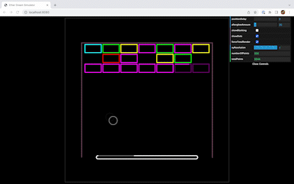

## What is this

I've been tecahing myself programming using the
[laser-dac library](https://github.com/Volst/laser-dac) and decided it would be a great idea to make a game of Breakout.

**Note:** Lasers are expensive but coding is free. The `laser-dac` library supports adding ILDA lasers via the Ether Dream, Helios, LaserCube, or other DACs. If you have the right equipment and want to test it out, let's get in touch.

**Another Note:** This code is VERY MUCH not optimised. Honestly it's a miracle it works at all.

# How to use

0. Ensure you've got `node` and `npm` set up. I'm using node v18 LTS and npm 8.15.
1. Clone the repo

- optional: add your laser DAC in index.ts

2. `cd` to `/src`
3. Run `npm i`
4. Run `npm run build`
5. Run `npm run dev`
6. Visit http://localhost:8080 in your fav browser

You should be seeing something like this in the centre of the screen:

Enjoy.
